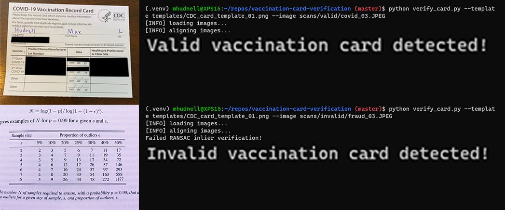

# Automated COVID Vaccination Card Verification

- [Automated COVID Vaccination Card Verification](#automated-covid-vaccination-card-verification)
  - [Usage](#usage)
  - [Installation & Setup](#installation--setup)



## Usage

```
usage: verify_card.py [-h] -i IMAGE -t TEMPLATE [--tag TAG]

optional arguments:
  -h, --help            show this help message and exit
  -i IMAGE, --image IMAGE
                        path to input image
  -t TEMPLATE, --template TEMPLATE
                        path to the vaccination template image
  --tag TAG             prefix for output visualization files
```

- Terminal usage: `python verify_card.py --template templates/CDC_card_template_01.png --image <path-to-input>`
- We found there were slight variations (different aspect ratio, spacing between lines) in the CDC vaccination cards that were issued, so you can specify a specific template to verify against. We provide two templates (`./templates/CDC_card_template_01.png` and `./templates/CDC_card_template_02.png`).


## Installation & Setup
1. Install Python3
2. (Optional) Create and activate a virtual environment
    ```bash
    python -m venv .venv
    source .venv/bin/activate
    ```
3. Install pip dependencies
    ```bash
    pip install -r requirements.txt
    ```
    - If wishing to contribute / alter the code, download the developer dependencies
        ```bash
        pip install -r requirements-dev.txt
        ```

